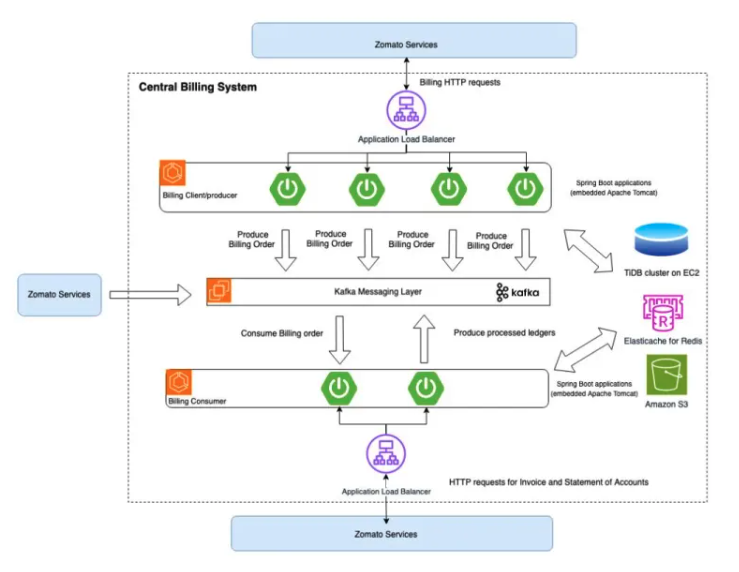
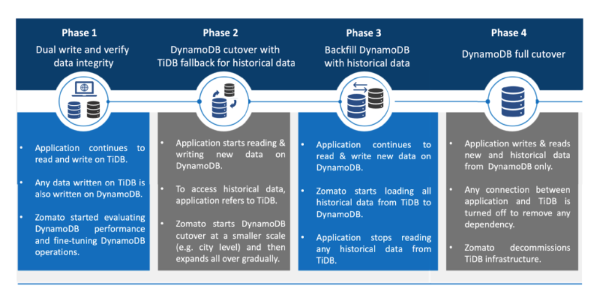

# Zomato Billing Platform's migration to DynamoDb

[Link to article](https://blog.zomato.com/switching-from-tidb-to-dynamodb)

### Tags:
NoSQL, SQL, DynamoDB, Zomato, TiDB, DynamoDB-Adjaceny List, Many-to-Many relationships, Database Migration.

## Intro

This article focuses on migration of Zomoto's Billing Platform's(ZBP) DN to DynamoDB

This platform effectively handles the distribution of payments to restaurant partners and riders at a large scale and processes around 10 million events on a typical day. This results in approximately 1 million payments on a weekly basis. Because generating invoices and processing payments is a mission-critical function for Zomato, the availability and resiliency of the billing system is important for the success of its business. 

## Architecture

Legacy Architecture 

Consisted of KAFKA Data Bus and for storage they used TiDB Database on EC2 instance

TiDB is an open source dist SQL DB that supports OLAP, OLTP workloads. Its a perfect combination of tradtitional SQL Acid properties and scalability of NoSQL DBs

It requires certain components:

- TiDB server – The TiDB server serves as a stateless SQL layer, providing external access through the MySQL protocol. It can be scaled horizontally and offers a unified interface through load balancing components.
- Placement Driver server – The Placement Driver (PD) server manages metadata and data scheduling commands within the cluster. It acts as the brain of the cluster by storing metadata and dynamically assigning data distribution tasks to TiKV nodes based on real-time reports.
- TiKV server – The TiKV server is responsible for distributed data storage and functions as a transactional key-value storage engine.
- TiFlash server – The TiFlash server is a specialized columnar storage server optimized for fast analytical processing, storing data in columns for improved performance.

## Challenges with this architecture:

- Schema changes were complicated and performance issues were observed with joins and subqueries
- Distributed design suffered
- Manual scaling up and scaling down
- No Cloud Solutions, locally managed, increased labour cost and an overhead
- Backing up manually became very difficult.

## Why DynamoDB:
- Already Adapted in other services
- Consistent performance while scaling up
- Related Data is stoered together
- Auto Scaling
- No manual work

## Solution Overview

- Use of adjaceny list concept to get rid of joins, reduces read/write time significantly
- SIngle Table Desgin
- Smart Partition Keys
- Migration Approach

