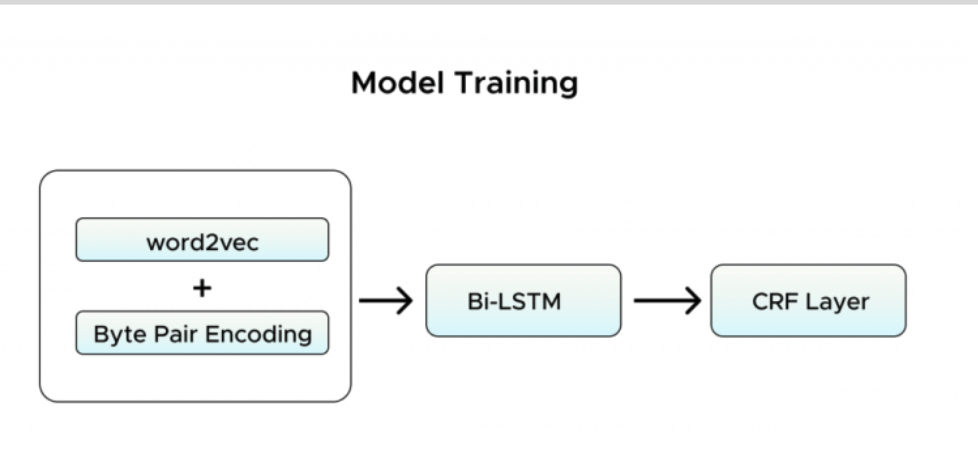

# Zomato Search - NLP,  to make it more inclusive and conversational

[Link to article](https://blog.zomato.com/how-we-make-our-search-more-conversational-and-inclusive)

### Tags
NLP, Search

## Introduction
For any domain specific search engines the engines are optimised for a specific category for exampple, apparel website/electornics etc.

For zomato, they want to optimise it for food, restaurants, cuisine and make it more coversational like "pizzas under Rs200"

A search engine works in this 2 steps
- Retrieval process (candidate set generation) i.e finding relevant entities for a given query with mazimum recall.
- Ranking the entities based on factors like entity popularity and keyword affinity towards the fetched affinity

## Current System
Heavily dependent on lexicalyy based matches and other factor. Multiple intents rank based on the lexical match.

## What Prompted the Change
After the introduction of voice search, users used longer queries with multiple intents.

Few Examples:
- Garlic Bread with cheese dip
- Koi Achcha Sa Sabji Batao
- Chai and samosa
- Burger 150rs wala

Unlike single-intent queries, long natural language searches involve a deeper understanding of items and optimising them to show relevant results.

### Natural Language Search

Natural language search allows customers to speak or type into a device using their everyday language rather than keywords and even use complete sentences or phrases in their native language. The computer then transforms these queries into something it can understand before showing results on the screen

For example, consider the query ‘XYZ outlet near me’

- Here, the intent is ‘nearest outlet’
-  **Entity** – ‘XYZ’ 
To better gauge the intent, we segment search queries in one of the three functionalities as below – 

Dish + Dish search – ‘Chai and Samosa’ 
Restaurant + Dish Search – ‘XYZ ka Burger’
Restaurant/Dish + near me/ best/ irrelevant text – ‘Pizza outlets near me’

## New Solution

Involves 2 steps:

- Model identifies 'Search Query' & City/location
- Returns 3 categories
    - Multiple Dish Search -> (Chai and Samosa)
    - Dish & Restaurant Search -> (XYZ ka burger)
    - Restaurant or Dish Seqarch with specifications -> (best joe’s pizza outlet near me)

## Understanding Challenges

- Unavailability of labelled data
- Queries involving more than 1 language
    - Sabse achha pizza 
    - Makni dal k sath naan
- Usage of word with multiple meanings
    - hirkutlal chole bhature –  (“chirkutlal chole bhature” – Restaurant)
    - chirkutlal k chole bhature – (“chirkutlal” – Restaurant, “chole bhature” – Dish)
- Spelling variations/ abbreviations/ aliases
    - Rajma rice or Rajma chawal, roomali roti or rumali roti (here, both are valid dishes)

## Model Training

Embedding based approach to capture the semantic relationship among words. Word2Vec by Google | But the major drawback of using word2vec is that it generates embeddings only for the words which are available in the vocabulary. Keeping the vocabulary of all possible words/ phrases is not a feasible solution.

So along with word2vec, we used Byte pair encoding (BPE)3 embeddings. BPE is a subword tokenisation-based method that tokenises the words based on their occurrence. 

Once we have our text (customer query) representation, sequentiality plays a vital role in name entity recognition. Both deep learning-based models like Recurrent Neural Network (RNN), Long Short-Term Memory (LSTM), and Gated Recurrent Unit (GRU) and statistical models such as Hidden Markov Models (HMM) and Conditional Random Field (CRF) are widely used. Both these methods are specialised for processing sequential data. We have taken a combination of both, more specifically bi-directional LSTM with CRF, inspired by this research paper on Bidirectional LSTM-CRF Models for Sequence Tagging4. 